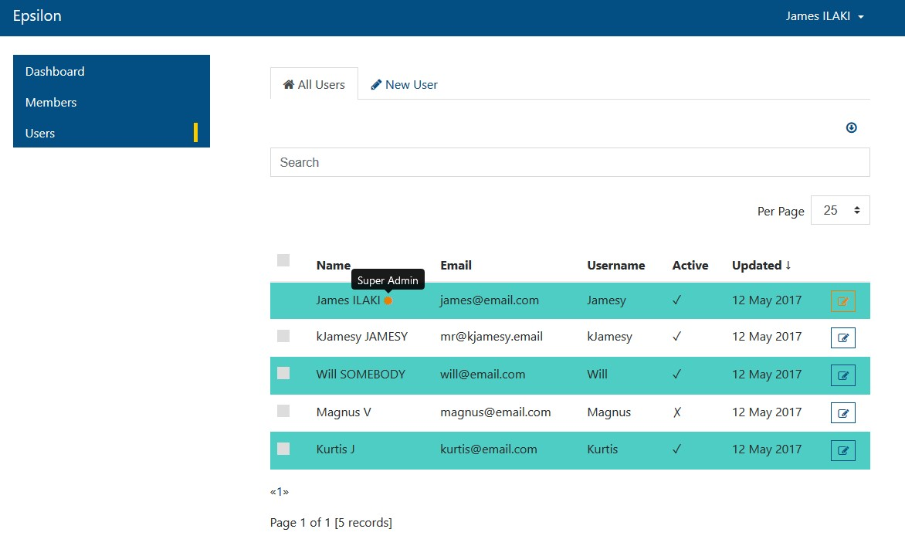
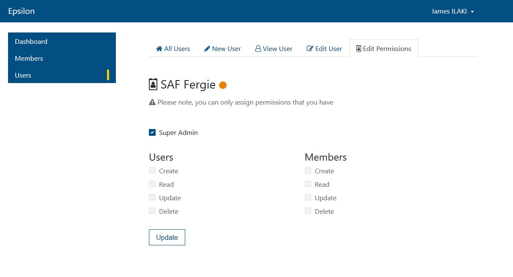
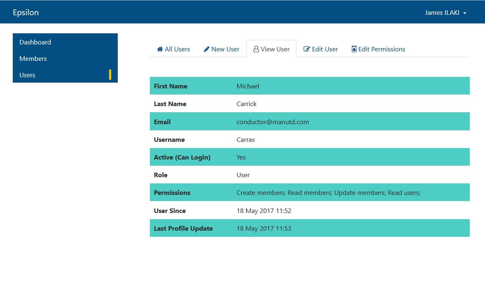

## Laravel 5.4 + VueJS Starter

* Auth extended to allow first_name, last_name, username, active & meta fields
* User profile editing functionality using vueJs router & resource
* VueJS router history mode 
* Authentication from two tables: users (admins) and members
* Customised auth emails for the two types of app users
* User management functionality with policy-based permissions
* Member management functionality
* Elastic search + Laravel scout for search
* Bootstrap 4

### Screenshots

#### Users Landing Page

#### Users Permissions Page

#### User Profile Page

#### VueJS History Mode

* More screenshots in /public/screenshots

### Installation Instructions
* `git clone https://github.com/kJamesy/laravel-vue-starter.git`
* `cd laravel-vue-starter`
* `composer install`
* `cp .env.example .env`
* `php artisan key:generate`
* Create your database + database user and the details to `.env`
* [Install Elastic search ^5.0](https://www.elastic.co/downloads/elasticsearch) to your system
* `php artisan migrate`

### Instructions for updating the app
* `npm install`
* `npm run watch`
* You will now be set up with a new URL which will auto-refresh the browser when any JS, PHP or SASS file changes
* Enjoy